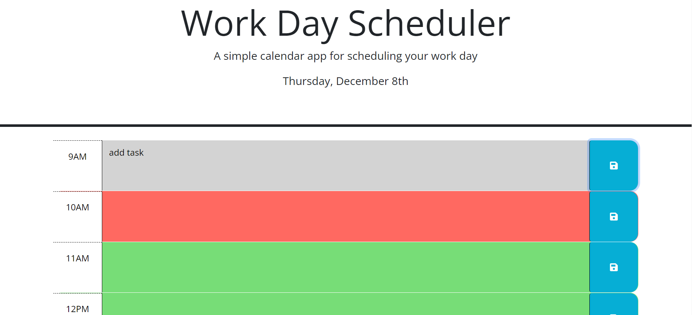
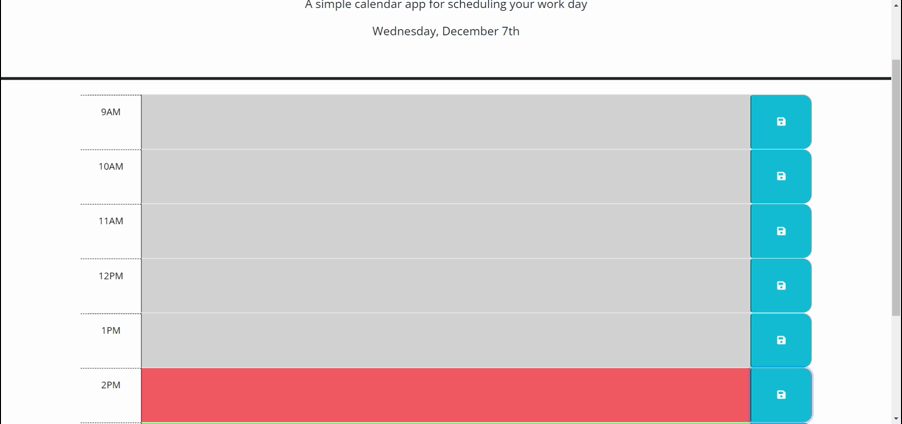

# Work Day Scheduler
[Link to My Project](https://zoerorvig.github.io/work-day-scheduler/)

## Table of Contents
- [Description](#description)
- [Visuals](#visuals)

## Description 
This webpage presents a simple calendar app for use when scheduling your work day.

Features Include:
- The current date displayed in the header section of the screen. 
- The user can enter a task into a time slot and click the save button. 
- Once the user clicks the save button, the task is stored in localStorage.
- If the page is refreshed, then the task will remain in the time slot. 
- The current time is tracked on the schedule using color coded "past", "present", or "future" classes. 

## Visuals 

The following is a screenshot of the whole page:

The following is a gif to show functionality:

